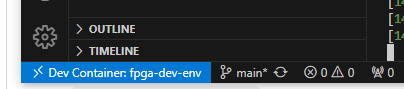

# 💡 Proyecto OSS CAD con Docker + VS Code

Este entorno te permite compilar automáticamente código VHDL o verilog para una FPGA iCE40HX4K usando herramientas libres como Yosys, GHDL y NextPNR, sin tener que instalar linux en tu sistema.

---

## ⚙️ Requisitos

Antes de empezar, necesitás tener instalado:

- 🐳 [**Docker Desktop**](https://www.docker.com/products/docker-desktop/)
- 💻 [**Visual Studio Code**](https://code.visualstudio.com/)
- 📦 Extensión de VS Code: **Dev Containers**  
  (Buscar en el marketplace como: `ms-vscode-remote.remote-containers`)
  
- :floppy_disk: [**Programador de lattice**](https://www.latticesemi.com/view_document?document_id=54451)

---

## 🚀 Cómo usar el entorno

1. **Cloná este repositorio**

   ```bash
   git clone https://github.com/Fresita-codificadora/Proyecto_Final_DOME.git
   ```

2. **Abrí la carpeta desde VS Code**

3. **Cuando VS Code detecte el contenedor, hacé clic en**:  
   `Reopen in Container` (Reabrir en contenedor)

   si no aparece apreta ctrl+p y en los comandos `Reopen in Container`
   
   Recorda que tenes que tener abierto el docker desktop si no ocurrira un error
5. **¡Listo! Ya estás dentro del entorno**.

   Para verificar que estas dentro del entorno, deberias tener un contenedor corriendo dentro de docker desktop y ademas en visual studio code en la esquina inferior izquierda debe aparecer "Dev Container:fpga-dev-env" en una pestaña azul

   
6. **Ahora te recomiendo instalarte dentro del entorno unas extenciones**
   - :pager: **VHDL** (Buscar en el marketplace como: `puorc.awesome-vhdl`)
   - :vhs:  **TerosHDL**(Buscar en el marketplace como: `teros-technology.teroshdl`)
   - :cd: **Verilog-HDL**(Buscar en el marketplace como: `mshr-h.veriloghdl`)
---

## 📁 Estructura del proyecto

| Carpeta       | Contenido                                        |
|---------------|--------------------------------------------------|
| `src/`        | Tu código fuente VHDL o Verilog                 |
| `constraints/`| Archivos `.pcf` con las restricciones del pinout |
| `output/`     | Aquí se genera el archivo `.bin` final           |

---

## 🛠️ Cómo compilar

### 🔘 Paso 1: Ejecutar la tarea de compilación

En VS Code, presioná `Ctrl+Shift+P` y elegí:

- `Run Task > Compilar VHDL` — para proyectos en VHDL
- `Run Task > Compilar Verilog` — para proyectos en Verilog

🧠 Te va a preguntar:

- El **nombre del módulo top** (sin extensión)
- El **archivo `.pcf`** correspondiente (sin `.pcf`)

-**importante el nombre del archivo debe coincidir con el nombre del entity**
### 📦 Resultado

El binario resultante se guarda como:

```
output/mi_modulo.bin
```

---

## ⬆️ Paso 2: Subir el binario a la FPGA

Una vez compilado, podés usar tu programador preferido.
te recomiendo 
👉 [**Programador de lattice**](https://www.latticesemi.com/view_document?document_id=54451)
[**como configurarlo**](imagenes/ComoUsarDiamondProgrammer.pdf)

si no el programador oficial IceStorm, descargalo desde:

📥 [https://github.com/cliffordwolf/icestorm](https://github.com/cliffordwolf/icestorm)

> Si usás otra herramienta como `iceprog`, `openFPGALoader` o similar, podés adaptarlo a tu flujo.
[**Drivers para el programador**](https://ftdichip.com/drivers/d2xx-drivers/)
---

## 📌 Licencia

MIT License – libre de usar y modificar.
